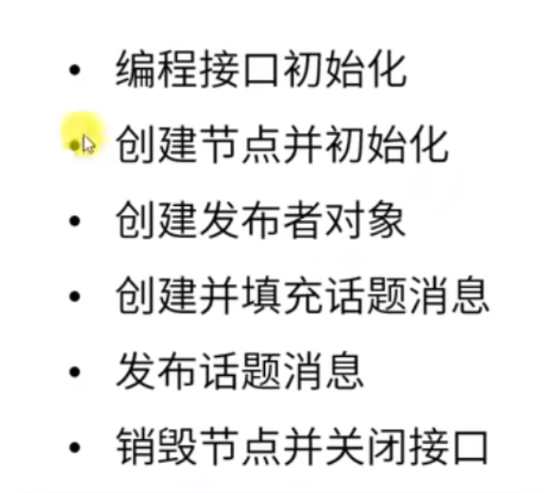
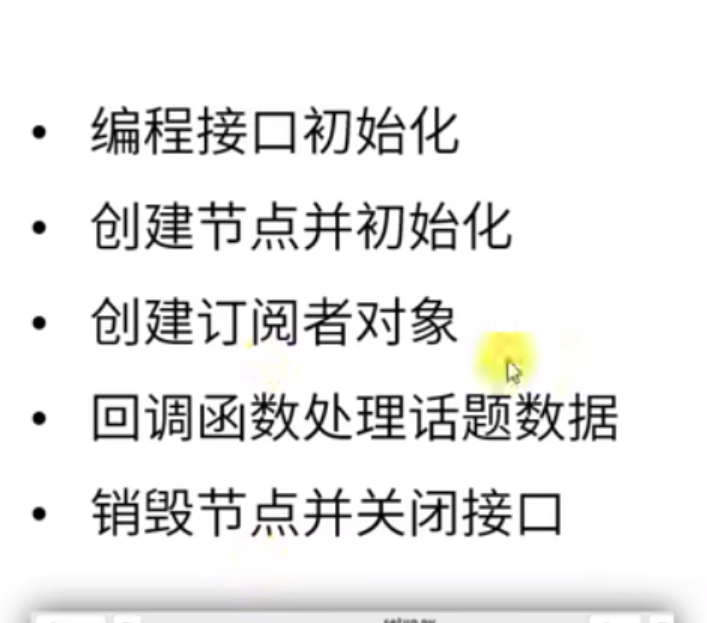

## 话题发布者流程

## 订阅者流程

## 常用命令
list: 列出所有topic
info /topic名: 查看话题信息
bw /topic名: 查看传输数据带宽

## 常用工具
rqt_graph 显示话题图

## 代码实现
- 回调函数的机制：接收消息(消息的格式是有标准格式定义的)之后自动接收消息（通过spin实现）中的数据然后调用回调函数，因此接收的数据必须和形参数量一致
